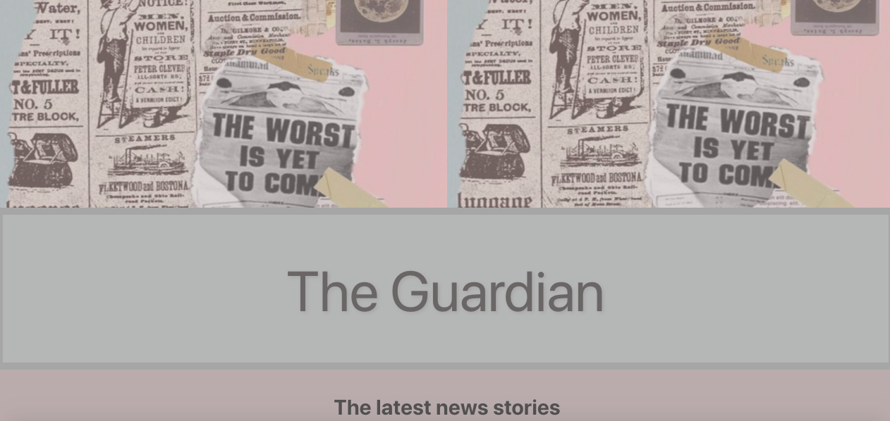
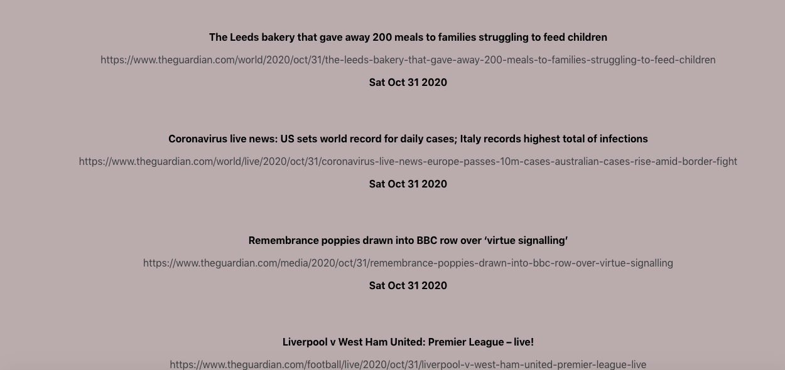

# Guardian News

**Guardian News** is deployed with **Surge** at: [this link](http://wicked-expert.surge.sh)!

For our Week 7 weekend challenge at Makers Academy, we were asked to create a single page application, using vanilla JavaScript, the Guardian API and our own testing frameworks.

I have re-created this application using React.

The ten most recent news stories are pulled in from the Guardian API as links and rendered on the page, with their title and date of publication.
These links are clickable. Clicking on them takes the user to the new story on the Guardian's website.

### How to run:

* Clone this repository: 
```html
git clone https://github.com/emilyjspencer/Guardian-News-React.git
```

* Navigate into the repository:
```html
cd Guardian-News-React
```

* Enter the following into the command line to install the dependencies:
```html
npm install
```
* Enter the following to start the application, which will open automatically in the browser at localhost:3000:
```html
npm start
```


### Built with:

* React
* CSS

### What it looks like:




### Deployed with Surge at: [this link](http://wicked-expert.surge.sh)!


